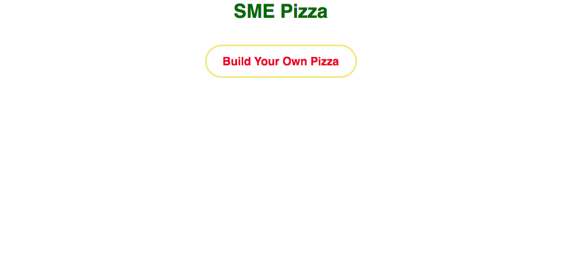
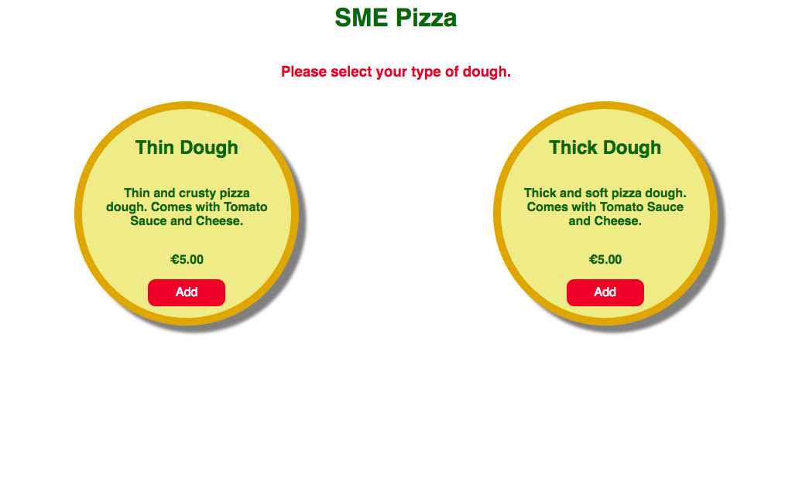
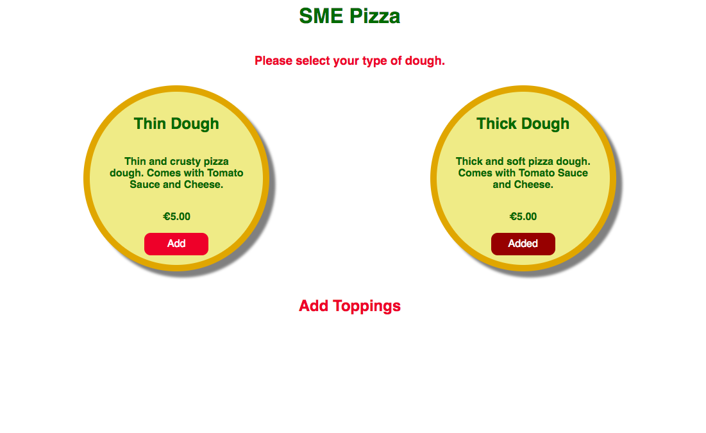
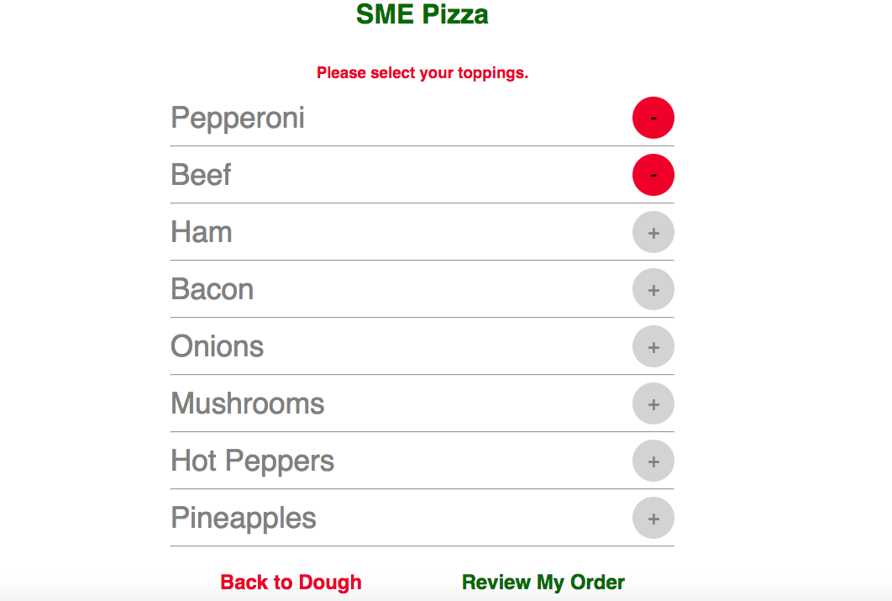
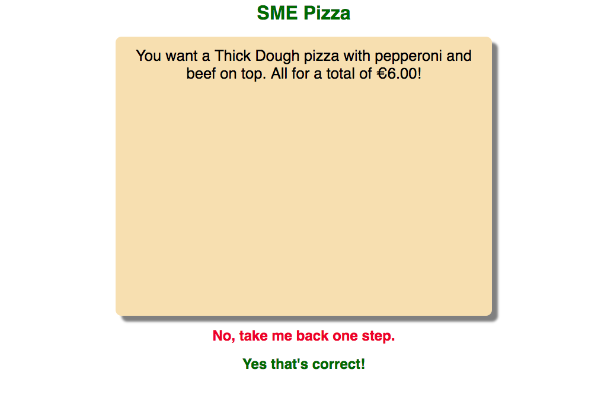

# pizza-picker
Mock Pizza Ordering Webapp using React, React Router

*Home Screen*

*Dough Screen*

After the customer picks thin or thick dough, the button to go to the toppings screen comes up.

*Toppings Screen*

*Review Order*

